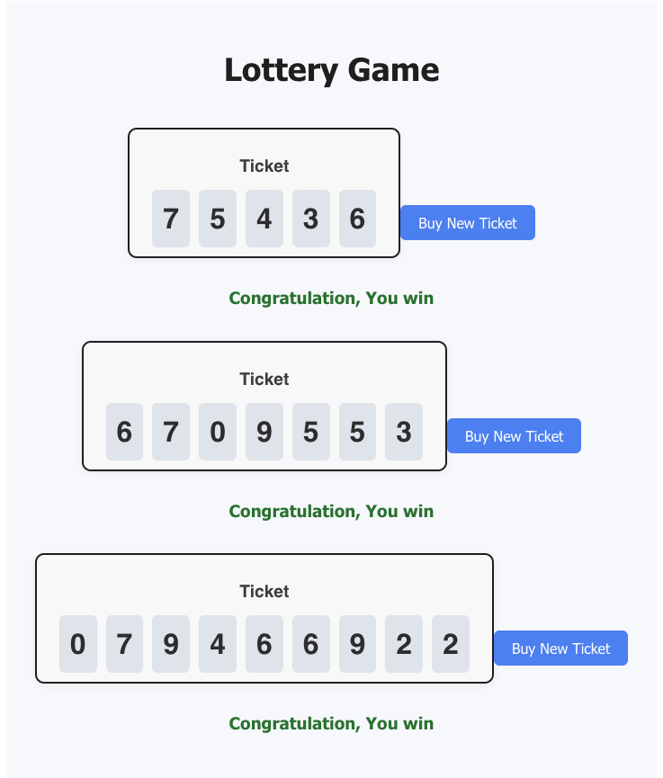

# 🎲 React Lottery Game

This is a simple yet fun Lottery Game built using **React.js**. It generates random tickets, checks if the ticket is a winner based on a target sum, and allows the user to keep buying new tickets with a single click.

---

## 🚀 Features

- Dynamic ticket generation
- Winning logic based on ticket sum
- Interactive UI with styled components
- Modular and clean React component structure

---

## 📸 Preview

---

## 🧠 How It Works

1. You provide:
   - `n`: Number of numbers in the ticket
   - `winningsum`: Target sum to win
2. The app generates `n` random numbers (like a lottery ticket)
3. If the sum of these numbers equals `winningsum`, the player wins!

---

## 🧱 Tech Stack

- [React.js](https://reactjs.org)
- JavaScript (ES6)
- CSS for styling

---