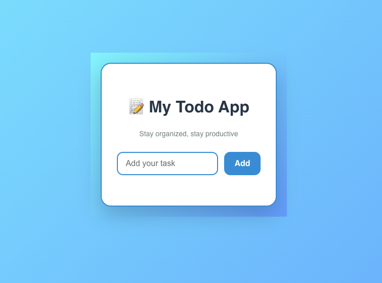

# 📝 Modern React Todo App

A sleek, responsive Todo application built using **React**, featuring:

- ✅ Add & delete tasks  
- 💾 Persistent storage via `localStorage`  
- 🖥️ Clean, modern card-based UI  
- 📱 Responsive design for all screen sizes  
- ⚡ Instant interactions with animations

---

## 🚀 Features

- 🔥 Add and delete tasks in real-time
- ⛔ Prevents empty tasks from being added
- 💾 Saves tasks in `localStorage` (persists on refresh)
- 🧠 Press `Enter` to add tasks quickly

---

## 🧑‍💻 Tech Stack

- ⚛️ [React](https://reactjs.org/)  
- 🎨 Custom CSS3 (no frameworks)
- 🌐 Chrome (optimized for modern browsers)

---

## 🛠️ Getting Started

### Clone the Repository
```bash
git clone 
cd todo-app
```
### Run

```
npm install
npm run dev
```

## Output



Done! 
--
